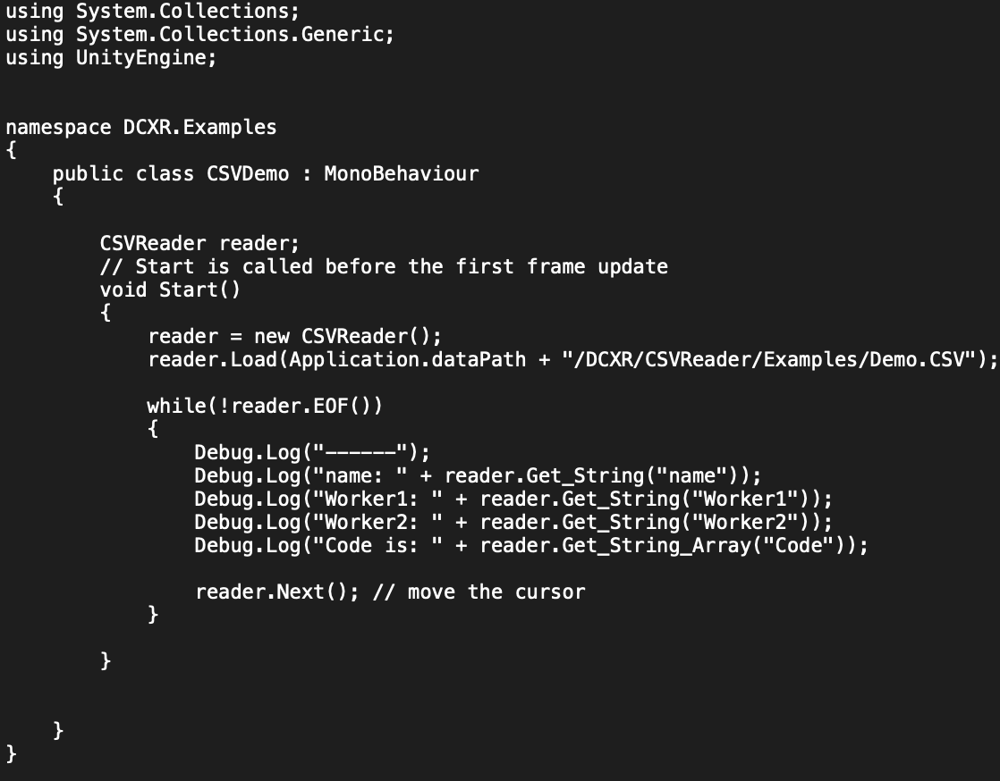

# CSV Reader
MIT License.

Unity 2019.x tested.

Author: [Haikun Huang](https://quincyhuang.github.io/Webpage/index.html)

My Lab: [DCXR](https://craigyulab.wordpress.com/code/)

Github: [Click Here](https://github.com/quincyhuang/DCXRKit)

**CSV Reader** is a helper tool helps you to read the csv files. 

It is easy and simple to use. 

# Quick Start
* Load a csv file.
* Read the data by the column name.
* Move the cursor to next row
* Keep reading the data, until the end of the file.
  

More details please see the example inside the tool.

# How does it work?
CSV Reader is technically a state machine, and it handles an internal cursor to always point to the current row, which allows CSV Reader to visit. 

# APIs
* Load a csv file which with the header row.  It is recommended to have the header row, which may easier to access the data by  the column name.
>public bool Load(string path, bool mapping_header = true);

* How many records the csv file has.
>public int Count();

* Reset the cursor to the first row.
>public bool Reset_Cursor();

* Move the cursor to the next row.
>public bool Next();

* End of the file.
>public bool EOF();

* Get the data by the given column name.
>public string Get_String(string colName);

* Get the array data by the given column name.
>public string[] Get_String_Array(string colName);

* Get the raw data of the current row.
>public List<string> Get_Origin_Record();

# Advantages
* Easy and simple to use.
* Lite-weight tool.

