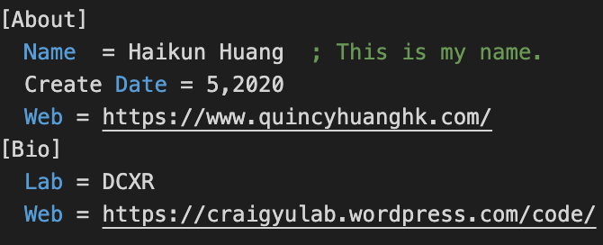

# Inifile
MIT License.

Unity 2019.x tested.

Author: [Haikun Huang](https://quincyhuang.github.io/Webpage/index.html)

My Lab: [DCXR](https://craigyulab.wordpress.com/code/)

Github: [Click Here](../../)

This tool helps to read and write a flexible and user-customized data structure from and into a plain file. This tool contains a rich set of APIs to help you to read and write the most Unity C#  basic data type from and into a given plain file. You can also easily extend the basic APIs to write your own extension APIs to read and write any data type.

# User-Customized Data Structure
The user-customized data structure looks like below:

It contains 2 parts, the **Sections** and the **key & value pairs (k&v pairs)**.

The **Section** is a collection of **k&v pairs**, the **k&v pair** is used to record the value by a unique key in each **Section**. And the comment of the **k&v pair** is the starting by a comma “;”.

# Quick Start
Please see the examples inside the tool.

# How does it work?
The **Inifile** class works like a state machine. It has an internal curser always pointing to the current **Section**, which means, all the actions are under the current **Section**.  The API **‌Goto_Section()** helps you to switch the **Sections**. 

# APIs
## Basic Function
* Load a file.
>public void Load_File(string fileName);

* Save a file.
>public void Save();

* Save as…
>public void SaveTo(string fileName);

* Create a new section and go to that section if it created success.
>public bool Create_Section(string section, string comment = “”);

* Go to the section if it existed. 
>public bool Goto_Section(string section);

* Set a new string value or update its value by the given key name.
  *This is the basic function as everything in plain file is the string. All the advance functions are extended from this basic function. This allows you to write your own functions by extended this function.*
>public void Set_String(string name, string value, string comment = “”);

* Get the string value by the give key name.
	*This is the basic function as everything in plain file is the string. All the advance functions are extended from this basic function. This allows you to write your own functions by extended this function.*
>public string Get_String(string name, string defaultValue = “”);

* A set of helper functions helps you to manage your data.
>public string[] Get_All_Section();
>public string[] Get_All_Pair_Names();
>public string[] Get_All_Pair_Values()

## More functions please refer to source code.

# Advantages
* Enable you to read and write the loosen data structure.
* Good for record and read the metadata.