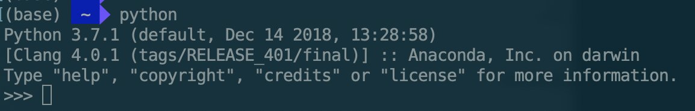
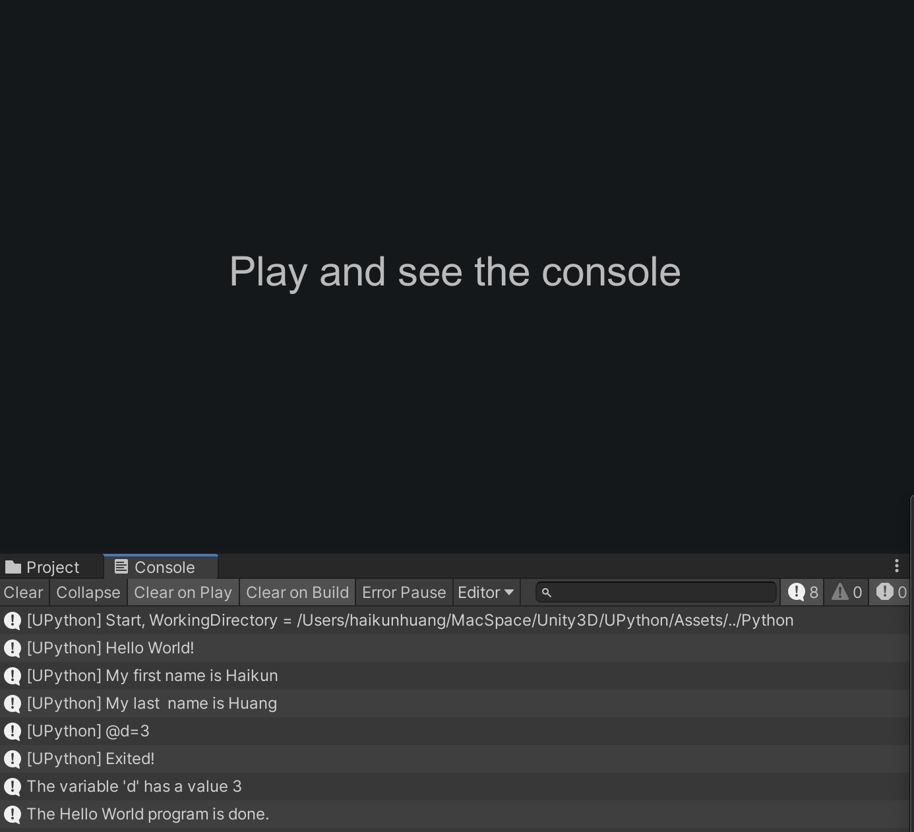
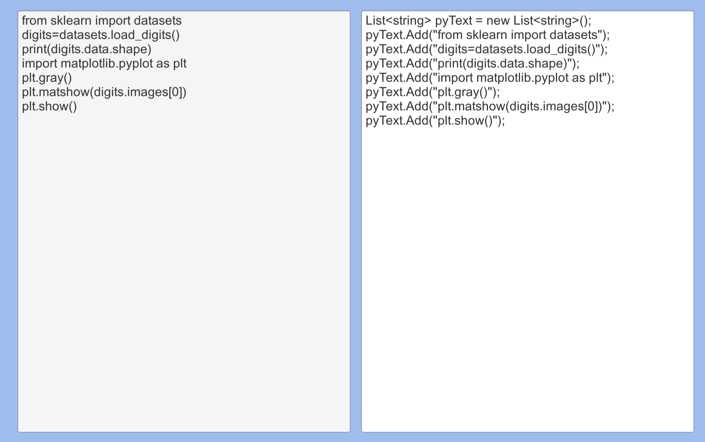
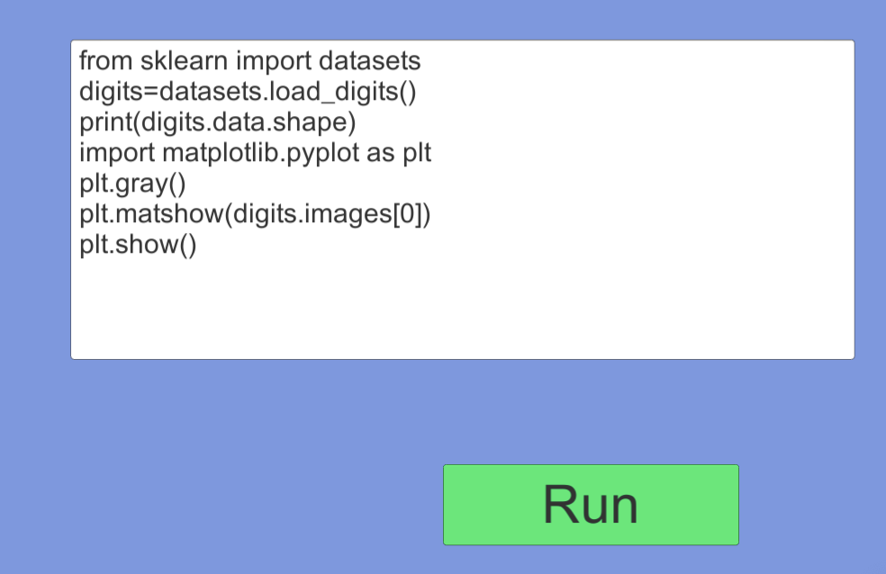

# UPython
MIT License.

Unity 2019.x tested.

Author: [Haikun Huang](https://www.quincyhuanghk.com)

My Lab: [DCXR](https://craigyulab.wordpress.com/code/)

Github: [Click Here](https://github.com/quincyhuang/UPython)

This plugin is more like a bridge connecting Unity and Python. UPython allows you to write and run the python code in Unity C# directly. UPython also will stream back the python output to Unity C# and allows you to do further actions.

## How it works?
Essentially, UPython first will generate a .py file base on the python code you wrote in Unity C#. UPython then will call the python command at CMD window on Windows or Terminal on OS X. 

# Quick Start
**UPython.cs** class is the core class of UPython. It inherited MonoBehaviour which technically allows you to run multiple python threads at the same time. 

Here is the quick start introduction:
* Make sure you have set up the python dev environment properly. To valid the setup, you can run the python command at CMD window on Windows or Terminal on OS X.  If it works, which means your setup is good to go. 

* Open the **UPython.cs** file, and change the variable **python_program**, make sure the **python_program** is pointing to your local python program, e.g.,

>static public string python_program = "/Users/haikunhuang/anaconda3/bin/python";

* You are ready to go.

# APIs & Variables
* The folder used to store the python files UPython generated. 
>public string runningFolder = "../Python";

* The file used to store the python files UPython generated. 
>public string runningFile = "demo.py";

* If shows the debug info at console.
>public bool showDebug = true;

* If UPython still running. (Reay Only)
>public bool isRunning { get; private set; } = false;

* The python script buffer.
>public List<string> script = new List<string>();

* The output buffer.
>public List<string> results = new List<string>();
>public List<string> errs = new List<string>();

* Store the variables with the'@' at the beginning of each line of the output stream.
  e.g., @a=1
  how to get the "a" variable?
  e.g., string something = variables["a"];
  **This dictionary helps you to retrieve the result more easily.**
  More detail please see the examples.
> public Dictionary<string, string> variables = new Dictionary<string, string>();

* Create a new Environment so that the previous result and script can be held by other references.
>public void NewEnvironment();

* Run the python script.
  If the callback function is not null, then the callback function will be invoked when the python script is done.
>public void Run(string args ="", UnityAction callback = null);

# Examples
## 1. HelloWorld
Must have a look, it shows the most basic functions of UPython.

## 2. Parser
A helper tool helps you to convert the Python code into a UPython friendly format in Unity C#.
Copy your python code into the left box, and the converted code will be shown in the right box immediately.

## 3. Run In UI Text
An example of running the Python code in real-time.
Input your python code in the input box and click Run. The result will show in the console. Also, the figure will pop out if there have any.

## 4.Use Case
A use case example, just run it and see what happen.

# Advantages
* Easy to integrate your work between Unity and Python.
* UPython Embeds all the variables into the Python code. So you don’t need to care how to pass the variables to the external Python code.
* Easy to retrieve the results after running UPython by looking up the “variables” dictionary.

# Limitations
* Low performance.
* Looks stupid.  

